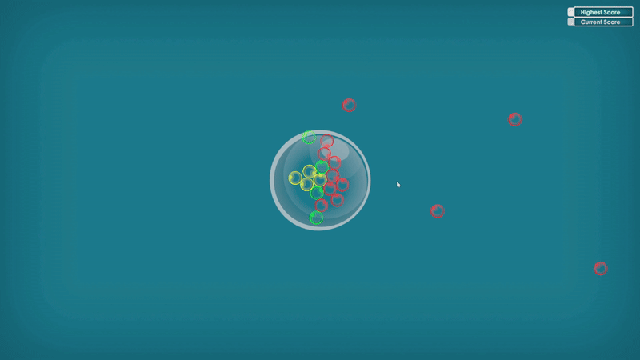
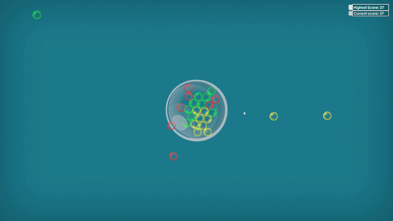

# Bubble UP!

## Intro

This is a repository for Global Game Jam 2025 submission - [Bubble UP!](https://globalgamejam.org/games/2025/bubble-0-11)

Now it is available on itch.io - [Check it out](https://echoness.itch.io/bubble-up)

Try your best to align bubbles together and achieve the highest score as you can!

- The same color bubbles combo! The score multiplies if you have more same bubbles.
- Watch out if any bubbles are outside the main bubble. You want them inside and make friends!

## Update

We are ready to release the game on Steam, [check it out here](e-choness.github.io/bubble-up-website/)!

## Engine & Packages

- **Unity Version**: [6000.0.32f](https://unity.com/releases/editor/whats-new/6000.0.32)
- **Packages Used**:
  - [Simple Space UI](https://dante-deketele.itch.io/simple-space-ui-pack)
  - [Let's Go! Action Soundtrack](https://assetstore.unity.com/packages/audio/music/let-s-go-action-soundtrack-56457)
  - [Glossy Bubbles](https://assetstore.unity.com/packages/2d/gui/icons/glossy-bubbles-114601)
  - [All In 1 VFX Toolkit](https://seasidestudios.gitbook.io/seaside-studios/vfx-toolkit)

## Features

### Gameplay

- **Bubble Alignment**: Rotate the main bubble to align bubbles of the same color for combos.
- **Score Multipliers**: Achieve higher scores with larger combos.
- **Physics-Based Interactions**: Bubbles interact dynamically with the main bubble and each other.

### Visual Effects

- **Custom Shaders**: Powered by the All In 1 VFX Toolkit for vibrant effects.
- **Dynamic Animations**: Smooth transitions and bubble popping animations.

### Audio

- **Soundtrack**: Includes tracks from the "Let's Go! Action Soundtrack."
- **Sound Effects**: Bubble popping and collision sounds enhance gameplay immersion.

### UI

- **Space-Themed UI**: Designed using the Simple Space UI pack for a futuristic look.
- **Score Panel**: Displays current and highest scores dynamically.

## Controls

- **Left Arrow Key**: Rotate the main bubble to the left.
- **Right Arrow Key**: Rotate the main bubble to the right.

## Development Details

### Code Structure

- **Scene Management**: Managed by [`System.SceneController`](Assets/Scripts/System/SceneController.cs).
- **Score Management**: Handled by [`System.ScoreManager`](Assets/Scripts/System/ScoreManager.cs).
- **Bubble Logic**: Implemented in [`Game.Bubble`](Assets/Scripts/Game/Bubble.cs).

### Visual Effects

- **Shaders**: Custom shaders located in [Assets/TextMesh Pro/Shaders](Assets/TextMesh%20Pro/Shaders).
- **Texture Atlas**: Created using the Texture Atlas Packer in [`AllIn1VfxWindow`](Assets/Plugins/AllIn1VfxToolkit/Scripts/AllIn1VfxWindow.cs).

### Tools & Plugins

- **All In 1 VFX Toolkit**: Provides tools for shader configuration, texture creation, and more.
- **TextMesh Pro**: Used for rendering high-quality text in the UI.

### Project Settings

- **Unity Editor Version**: 6000.0.32f1

## Credits

| Role                   | Name             |
| ---------------------- | ---------------- |
| Gameplay Engineer      | Roger Hatfull    |
| System & UI Engineer   | Echo (Beili) Yin |
| UI Engineer & Designer | Neal Wagram      |

## Contact

For questions or feedback, reach out via [GitHub Issues](https://github.com/e-choness/bubble-up/issues) or email the team at [bubbleup@bubbleupgame.com](mailto:bubbleup@bubbleupgame.com).
