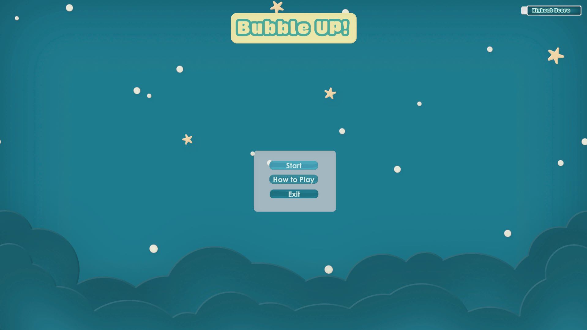

# Bubble Up!

## Intro

This is a respository for Global Game Jam 2025 submission - [Bubble Up!](https://globalgamejam.org/games/2025/bubble-0-11)

Now it is available on itch.io - [Check it out](https://echoness.itch.io/bubble-up)

Try your best to align bubbles together and achieve the highest score as you can!

- The same color bubbles combo! The score multiplies if you have more same bubbles.

- Watch out if any bubbles is outside the main bubble. You want them inside and make friends!

## Engine & Packages

- [Unity 6000.0.32f](https://unity.com/releases/editor/whats-new/6000.0.32)
- [Simple Space UI](https://dante-deketele.itch.io/simple-space-ui-pack)
- [Let's Go! Action Soundtrack](https://assetstore.unity.com/packages/audio/music/let-s-go-action-soundtrack-56457)
- [Glossy Bubbles](https://assetstore.unity.com/packages/2d/gui/icons/glossy-bubbles-114601)
- [All In 1 VFX Toolkit](https://seasidestudios.gitbook.io/seaside-studios/vfx-toolkit)

## Controls

(Left Arrow Key) -> Rotate main bubble to the left

(Right Arrow Key) -> Rotate main bubble to the right

## Credits

- Roger Hatfull
- Echo Yin
- Neal Wagram
